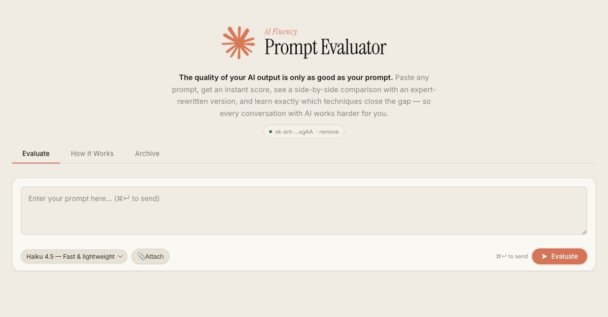
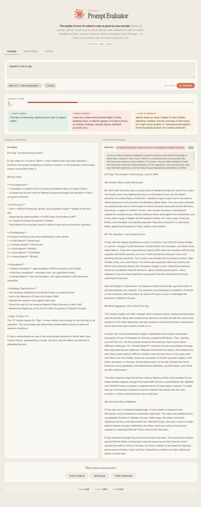
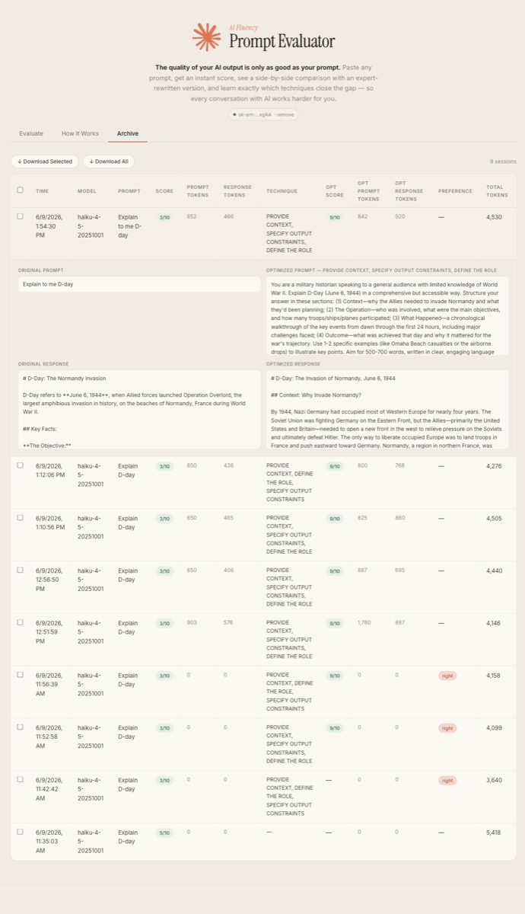
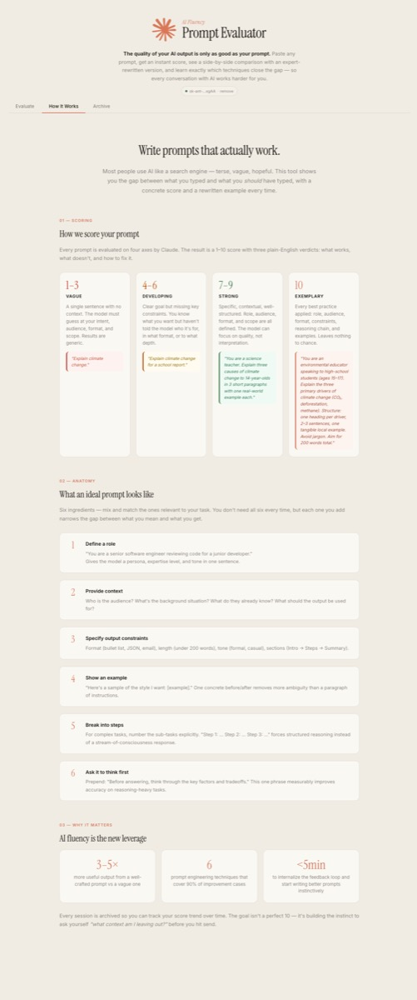

# AI Fluency — Prompt Evaluator

**Most people use AI like a search engine — terse, vague, hopeful. They get generic answers and assume that's just what AI does. It isn't.**

The difference between a 3/10 prompt and a 9/10 prompt is usually one or two missing ingredients: a clear role, a format constraint, a concrete example, a reasoning chain. This tool makes that gap visible, measurable, and fixable — in seconds.

---

## Why I built this

I've been using Claude daily and noticed that the quality of my results varied wildly — not because the model was inconsistent, but because *my prompts* were. I wanted a feedback loop: paste a prompt, see a score, understand why it scored that way, and immediately see what an expert-rewritten version looks like side by side.

This tool is the result. It's built on the **AI Fluency Framework** — the idea that AI leverage comes from four skills: Delegation, Description, Discernment, and Diligence. Prompt quality lives in the Description dimension, and it's the easiest one to improve with the right feedback.

---

## What it does

### Step 1 — Paste your prompt, choose a model



Pick Claude Haiku (fast, cheap), Sonnet (balanced), or Opus (most capable). Hit Evaluate.

---

### Step 2 — Get scored, rewritten, and compared



Five things happen in parallel:

| Call | What it does |
|------|-------------|
| 1 | Scores your original prompt 1–10, explains what works, what doesn't, and how to fix it |
| 2 | Runs your original prompt and shows the response on the left |
| 3 | Rewrites your prompt using the best combination of 6 prompt engineering techniques |
| 4 | Runs the optimized prompt and shows the response on the right |
| 5 | Scores the optimized prompt so you can see the jump (e.g. 3/10 → 9/10) |

Everything streams in real time via SSE.

---

### Step 3 — Track your sessions in the Archive



Every evaluation is saved to a local SQLite database. The archive shows:
- Your original score vs. the optimized score
- Which prompt engineering techniques were applied
- Exact token counts — your prompt's tokens, the response tokens, optimized prompt tokens, and the grand total
- Your preference (which response you liked better)

Export any selection to Excel for reporting or analysis.

---

### Step 4 — Learn the framework



The **How It Works** tab explains:
- The 1–10 scoring rubric with color-coded examples at each level
- The 6 prompt engineering techniques the optimizer uses
- Why prompt fluency matters and how to build the instinct over time

---

## The 6 prompt engineering techniques

The optimizer applies the most impactful combination of these per prompt:

| # | Technique | Example |
|---|-----------|---------|
| 1 | **Define a role** | "You are a senior software engineer reviewing code for a junior developer." |
| 2 | **Provide context** | Add audience, background, purpose, constraints |
| 3 | **Specify output constraints** | Format, length, tone, sections |
| 4 | **Show an example** | One concrete before/after removes more ambiguity than a paragraph of instructions |
| 5 | **Break into steps** | Number the sub-tasks explicitly for complex work |
| 6 | **Ask it to think first** | "Before answering, think through the key factors…" |

---

## Scoring rubric

| Score | Level | What it means |
|-------|-------|---------------|
| 🔴 1–3 | Vague | Single sentence, no context. Model must guess intent, audience, format, scope. |
| 🟡 4–6 | Developing | Clear goal but missing constraints — who it's for, what format, how deep. |
| 🟢 7–9 | Strong | Role, audience, format, and scope all defined. Model can focus on quality. |
| 🟠 10 | Exemplary | Every best practice applied: role, audience, format, constraints, reasoning, examples. |

---

## Setup

### Requirements
- Python 3.12+
- An [Anthropic API key](https://console.anthropic.com/settings/keys)

### Install & run

```bash
git clone https://github.com/aatabarezz/ai-fluency-prompt-evaluator
cd ai-fluency-prompt-evaluator/prompt-eval

pip install -r requirements.txt
uvicorn server:app --port 8001
```

Open **http://localhost:8001** — on first load you'll be prompted to enter your API key. It's stored locally in `.api_key` and never committed.

---

## Models

| Model | Speed | Best for |
|-------|-------|----------|
| Haiku 4.5 | Fast & cheap | Quick iteration, learning the feedback loop |
| Sonnet 4.5 | Balanced | Most everyday use cases |
| Opus 4 | Most capable | Complex reasoning, high-stakes prompts |

All models support **multimodal input** — attach images with the 📎 button to add visual context to your prompt.

---

## Tool use

Claude can call two tools during response generation:

- **`python_exec`** — runs Python in a sandboxed subprocess (10s timeout). Useful for math, data analysis, algorithms.
- **`web_search`** — queries DuckDuckGo. Useful for current events, factual lookup.

---

## Tech stack

| Layer | Technology |
|-------|-----------|
| Backend | FastAPI + Anthropic SDK |
| Frontend | Single-file HTML/CSS/vanilla JS (no framework) |
| Streaming | Server-Sent Events (SSE) |
| Storage | SQLite |
| Export | openpyxl (.xlsx) |

---

## Security

- `.api_key` is in `.gitignore` — never committed
- `sessions.db` is gitignored
- This is a local dev tool — do not expose port 8001 publicly

---

## License

MIT
